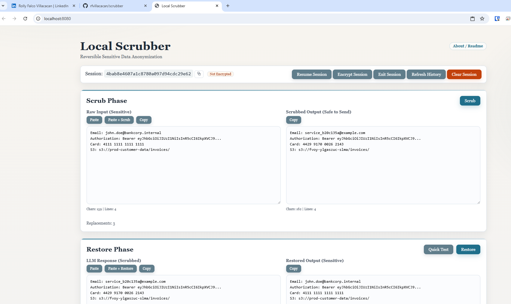

# Scrubber

Scrubber is a local-first PHP application for reversible sensitive-data anonymization. It replaces **only sensitive values** with realistic fake data while **preserving technical context** (protocols, ports, versions, common infrastructure), making it ideal for sharing logs with external tools like AI assistants.

**Key differentiator**: Scrubber intelligently distinguishes between sensitive data (secrets, PII, tokens) and technical context (standard protocols, public registries, version tags) using entropy-based detection - so you get safe, shareable logs that AI assistants can actually understand and troubleshoot!

> 💡 **New to Scrubber?** Check out the [LinkedIn Post](LINKEDIN_POST.md) for a quick overview of what makes this tool special!

## Features

- **Technical Context Preservation** - Intelligently preserves non-sensitive technical data (protocols like `s3://`, ports like `:5000/`, versions like `:alpine`, common registries) using entropy-based detection - only scrubs actual secrets!
- **Realistic Fake Data Generation** - Generates contextually appropriate fake data (emails, IPs, UUIDs, etc.) instead of obvious placeholders
- **Label Preservation** - Preserves labels like "Request-ID:", "Email:", "IP:" for better troubleshooting context
- **Smart Format Matching** - Analyzes and preserves original value characteristics (case, character types, length, special characters)
- **Consistent Mapping** - Same values always map to the same fake value throughout a document (global caching by data type)
- **JSON-Driven Rules** - All detection patterns and generators configured in JSON files - no code changes needed to add rules
- **Session-scoped Storage** - SQLite-based reversible mapping storage with optional encryption
- **Priority-Based Processing** - Higher-priority rules process first to prevent overlapping matches
- **HTTPS Docker Deployment** - Browser clipboard API compatibility for secure contexts

## 📸 Screenshot



**The Scrubber interface** showing the scrub phase with raw input (left) and scrubbed output (right). The Quick Test button verifies accurate restoration of original values.

## 🎥 Demo Video

<p align="center">
  <a href="docs/images/demo.mp4">
    
  </a>
</p>

<p align="center">
  <a href="docs/images/demo.mp4">📺 Watch Demo</a> | See Scrubber in action - anonymize logs in seconds!
</p>

**Watch the demo** to see Scrubber in action:
- Paste sensitive log data with emails, IPs, tokens, and passwords
- Click Scrub to instantly anonymize with realistic fake data
- Preserve technical context while protecting sensitive information
- Quick Test verifies accurate restoration

## Quick Start (Docker)

Choose between **HTTP** (simpler, for local development) or **HTTPS** (required for clipboard features and production).

### Option 1: HTTP Deployment (Simpler - No Certificates Required)

1. **Create env file:**

```bash
cp .env.example .env
```

2. **Configure HTTP port (optional):**

Edit `.env` to set your preferred HTTP port (default is `8080`):

```bash
HTTP_PORT=8080
APP_RETENTION_DAYS=30
```

3. **Start containers:**

```bash
docker compose up -d --build
```

4. **Verify deployment:**

```bash
# Check container status
docker compose ps

# Test health endpoint
curl http://localhost:8080/healthz.php
```

5. **Access the application:**

```
http://localhost:8080
```

### Option 2: HTTPS Deployment (Required for Clipboard Features)

HTTPS is required for browser clipboard API access and recommended for production use.

1. **Create env file:**

```bash
cp .env.example .env
```

2. **Provide TLS certificates:**

Place your SSL certificates in the `certs/` directory:

```bash
mkdir -p certs
# Copy your certificates to:
certs/fullchain.crt
certs/private.key
```

**For development/testing, generate self-signed certificates:**

```bash
openssl req -x509 -nodes -days 365 -newkey rsa:2048 \
  -keyout certs/private.key \
  -out certs/fullchain.crt \
  -subj "/C=US/ST=State/L=City/O=Organization/CN=localhost"
```

3. **Configure HTTPS port (optional):**

Edit `.env` to set your preferred HTTPS port (default is `9443`):

```bash
HTTPS_PORT=9443
CERT_FULLCHAIN_PATH=./certs/fullchain.crt
CERT_KEY_PATH=./certs/private.key
APP_RETENTION_DAYS=30
```

4. **Start containers:**

```bash
docker compose up -d --build
```

5. **Verify deployment:**

```bash
# Check container status
docker compose ps

# Test health endpoint (use -k for self-signed certs)
curl -k https://localhost:9443/healthz.php
```

6. **Access the application:**

```
https://localhost:9443
```

If using self-signed certificates, accept the security warning in your browser.

### Useful Docker Commands

```bash
# View application logs
docker compose logs -f app
docker compose logs -f web

# Stop the application
docker compose down

# Restart the application
docker compose restart

# Rebuild after code changes
docker compose up -d --build

# Check container health
docker compose ps
```

## How It Works

### Scrubbing Example - Technical Context Preserved

**Input (with Docker and S3 references):**
```
Deploying container: registry.corp.internal:5000/billing-service:2.14.7
S3 bucket: s3://prod-customer-data/invoices/
Database: postgres-db.prod.internal:5432/paymentdb
Secret: AKIA1234567890ABCDEFGHI
Email: john.doe@corp.internal
```

**Output (safe to share with AI):**
```
Deploying container: registry.corp.internal:5000/payment-service:2.14.7
S3 bucket: s3://fake-invoice-bucket/Xyz9/
Database: postgres-db.prod.internal:5432/accountdb
Secret: AKIA9876543210ZYXWVUTSQR
Email: user_3a2f1b@example.com
```

**Notice what's preserved (technical context):**
- ✅ `registry.corp.internal:5000/` - Common registry and port preserved
- ✅ `:2.14.7` - Version tag preserved (AI needs this to troubleshoot)
- ✅ `s3://` protocol preserved
- ✅ `postgres-db.prod.internal:5432/` - Infrastructure host and port
- ✅ `.corp.internal` domain - Internal network structure

**Notice what's scrubbed (sensitive data):**
- 🔒 `billing-service` → `payment-service` (business-sensitive container name)
- 🔒 `prod-customer-data` → `fake-invoice-bucket` (business-sensitive bucket name)
- 🔒 `paymentdb` → `accountdb` (business-sensitive database name)
- 🔒 `AKIA123...` → `AKIA987...` (AWS access key - secret!)
- 🔒 `john.doe@corp.internal` → `user_3a2f1b@example.com` (entire email scrubbed, domain replaced!)

### Scrubbing Example - Basic Data

**Input:**
```
Error in transaction. Request-ID: abc123def456, Customer: CUST-884422,
Email: john@example.com, IP: 192.168.1.100, Source Account: 123456789012
```

**Output:**
```
Error in transaction. Request-ID: fed987-1234-5678-90ab-cdef12345678,
Customer: CUST-4d2f28, Email: account_3a2f@example.com,
IP: 217.89.45.112, Source Account: 987654321098
```

### Key Behaviors

1. **Technical context preserved** - Protocols, ports, versions, common registries kept intact for troubleshooting
2. **Labels are preserved** - "Request-ID:", "Customer:", "Email:", etc. remain intact
3. **Same value = same fake** - Multiple occurrences of `john@example.com` become the same fake email
4. **Contextual fake data** - Emails look like emails, IPs look like IPs, UUIDs maintain format
5. **Structure maintained** - The scrubbed text remains valid and parseable

## Architecture

### Project Layout

```
scrubber/
├── index.php              # Main endpoint and UI shell
├── assets/                # Frontend JavaScript and CSS
├── lib/
│   ├── ScrubberEngine.php # Generic scrubbing engine (JSON-driven)
│   ├── RulesRegistry.php  # Loads and validates rules from JSON
│   ├── DataGenerator.php  # Generates realistic fake data
│   ├── Storage.php        # Session mapping storage
│   ├── Validator.php      # Pattern validation functions
│   └── Logger.php         # Logging utility
├── rules/                 # Bundled rulesets (JSON configuration)
│   ├── pii.scrubrules.json      # Personal identifiable information
│   ├── tokens.scrubrules.json   # Credentials, tokens, secrets
│   ├── finance.scrubrules.json  # Banking and financial data
│   ├── pci.scrubrules.json      # Payment card data
│   ├── network.scrubrules.json  # Network infrastructure
│   ├── cloud.scrubrules.json    # Cloud and DevOps identifiers
│   ├── corp.scrubrules.json     # Corporate confidential data
│   ├── phi.scrubrules.json      # Protected health information
│   ├── general.scrubrules.json  # General sensitive data
│   └── banking.scrubrules.json  # Banking-specific patterns
├── docs/                  # Documentation
├── docker/                # nginx and php-fpm container setup
└── data/                  # Runtime session databases (gitignored)
```

### JSON Rule Configuration

All detection patterns and generation logic are configured in JSON files. No PHP code changes needed to add new rules.

**Rule File Structure:**

```json
{
    "ruleset_id": "PII",
    "version": "1.2.2",
    "description": "Personally identifiable information detection",
    "author": "Security",
    "priority_base": 800,
    "rules": [
        {
            "id": "EMAIL",
            "enabled": true,
            "priority": 300,
            "pattern": "\\b([A-Za-z0-9._%+-]+@[A-Za-z0-9.-]+\\.[A-Za-z]{2,})\\b",
            "flags": "i",
            "validation": null,
            "generator": "email",
            "cache_type": "global",
            "data_type": "email",
            "skip_length_adjust": true
        }
    ]
}
```

**Rule Fields:**

| Field | Type | Description |
|-------|------|-------------|
| `id` | string | Unique identifier for this rule |
| `enabled` | boolean | Whether this rule is active |
| `priority` | integer | Rule priority (added to priority_base) |
| `pattern` | string | Regex pattern (use capturing groups for label preservation) |
| `flags` | string | Regex flags (e.g., "i" for case-insensitive) |
| `validation` | string|null | Validator function name (e.g., "luhn", "jwt_structure") |
| `generator` | string | DataGenerator method (e.g., "email", "uuid", "ipv4") |
| `cache_type` | string | "global" for consistency across data types, "local" for unique per-rule |
| `data_type` | string | Data type identifier for global caching |
| `skip_length_adjust` | boolean | If true, don't adjust fake value length to match original |

**Priority System:**

```
Final Priority = priority_base + rule_priority

Higher priority rules process first to prevent overlaps.
Current hierarchy:
- PCI (1000): Payment card data
- FINANCE (900): Banking identifiers
- TOKENS (900): Credentials, tokens, secrets
- PII (800): Personal identifiable information
- PHI (850): Protected health information
- BANKING (850): Banking-specific patterns
- CLOUD (700): Cloud and DevOps identifiers
- NETWORK (700): Network infrastructure
- CORP (600): Corporate confidential data
- GENERAL (950): General sensitive data
```

### Label Preservation with Capturing Groups

Use capturing groups `(...)` to extract only the value portion, preserving labels.

**Bad - Replaces entire match including label:**
```json
{
    "pattern": "\\b(?:REQUEST-ID|TRACE-ID)\\s*[:=]\\s*[A-F0-9-]{16,}\\b"
}
```
Result: `Request-ID: abc123` → `fed456` (label lost!)

**Good - Capturing group preserves label:**
```json
{
    "pattern": "\\b(?:REQUEST-ID|TRACE-ID)\\s*[:=]\\s*([A-F0-9-]{16,})\\b"
    //                                                 ^^^^^^^^^^^^^   ← CAPTURE GROUP
}
```
Result: `Request-ID: abc123` → `Request-ID: fed456` (label preserved!)

### Global vs Local Caching

**Global caching (`cache_type: "global"`):**
- Same value across entire document gets same fake value
- Used for: emails, IPs, UUIDs, customer IDs, etc.
- `data_type` field groups same data types across different rules

**Local caching (`cache_type: "local"`):**
- Same value might get different fake values in different contexts
- Used for: passwords, API keys, tokens, etc.
- Each rule maintains its own cache

### Available Data Generators

| Generator | Output Example | Use For |
|-----------|---------------|---------|
| `email` | `user_3a2f1b@example.com` | Email addresses |
| `uuid` | `8ec42f64-146f-616b-6d8d-c2abe4a0e941` | UUIDs, trace IDs |
| `ipv4` | `217.89.45.112` | IPv4 addresses |
| `cidr` | `172.16.0.0/12` | CIDR notation |
| `phoneNumber` | `+1 (783) 6743-9208` | Phone numbers |
| `personName` | `Jane Smith` | Person names |
| `customerId` | `CUST-4d2f28` | Customer IDs |
| `accountId` | `ACC-12345678` | Account IDs |
| `password` | `Xy9@bB2$kL` | Passwords |
| `jwt` | `eyJhbG...` | JWT tokens |
| `bearerToken` | `tok_abc123xyz789` | Bearer tokens |
| `amount` | `1250.00` | Financial amounts |
| `iban` | `GB82WEST12345698765432` | IBANs (ALL CAPS, length preserved) |
| `s3Bucket` | `s3://my-fake-bucket/path` | S3 bucket URIs (preserves s3://) |
| `dockerRegistry` | `registry.corp.internal:5000/service:alpine` | Docker registries (preserves ports, versions) |
| `string` | `aB3xY7` | Generic strings (smart format matching) |
| `creditCard` | `4532015112830366` | Credit card numbers |

### Smart Format Matching

The `string` generator uses **smart format matching** to preserve original value characteristics:
- **Case**: Original letter case is preserved (UPPER, lower, MixedCase)
- **Character types**: Letters, numbers, and special characters maintained in position
- **Length**: Output length matches input length (unless `skip_length_adjust: true`)
- **Special chars**: Punctuation, symbols, and structural characters preserved

This ensures fake data looks realistic while maintaining the original structure.

### Entropy-Based Detection

The system uses **Shannon entropy calculation** to distinguish between:
- **Secrets/tokens**: High-entropy values (API keys, hashes, tokens)
- **Technical data**: Low-entropy values (common registries, known containers)
- **Business-sensitive**: Values containing business terms (payment, billing, etc.)

This value-based approach is more reliable than hardcoded lists of known values.

## Security Notes

- **Do not commit** real session databases, logs, certs, or `.env` files
- **Clipboard features** require a secure browser context (`https://` or trusted localhost)
- **Optional HTTP Basic auth** via `APP_BASIC_AUTH_USER` and `APP_BASIC_AUTH_PASS`
- **Session retention** tuned with `APP_RETENTION_DAYS` (default: `30`)
- **Encryption support** - Sessions can be encrypted with a passphrase

## Production Env Template

Use this as a baseline `.env` for public or shared deployment:

```dotenv
APP_UID=1000
APP_GID=1000
HTTPS_PORT=9443
CERT_FULLCHAIN_PATH=./certs/fullchain.crt
CERT_KEY_PATH=./certs/private.key
APP_RETENTION_DAYS=14
APP_BASIC_AUTH_USER=change-me
APP_BASIC_AUTH_PASS=change-me-long-random-secret
```

Minimum recommendations:
- Use a long random `APP_BASIC_AUTH_PASS`
- Keep `APP_RETENTION_DAYS` low for shared deployments
- Never commit `.env` or real certificate/key files

## Adding Custom Rules

1. Create a new `.scrubrules.json` file in the `rules/` directory
2. Follow the rule structure shown above
3. Use capturing groups for label preservation
4. Choose appropriate generator, cache_type, and data_type
5. Set appropriate priority to avoid conflicts
6. Restart the application to load new rules

No code changes required - the ScrubberEngine automatically loads all rules from JSON.

## License

MIT. See `LICENSE`.
